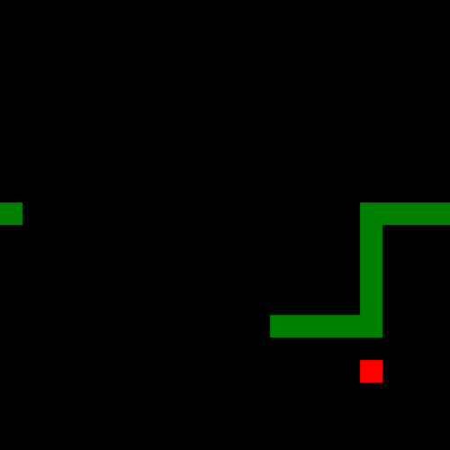

# Systèmes dynamiques

## Le problème général

## Un exemple concret : les rotations du cercle:

$𝕊^1$
$α$ 
$ρ$
$𝕋 = ℝ/ℤ = [0,1]/\{0~1\}$. 

## Les rotations comme échanges d'intervalles

Paramétre: $α ∈ [0,1[$
Espace des phases: $𝕋 = ℝ/ℤ = [0,1]/\{0~1\}$

$\begin{array}{rcrcl} ρ_- & : & [0,1-α[ & \to     & [α,1[\\
                            &   &    x   & \mapsto & x + α 
\end{array}$

$\begin{array}{rcrcl} ρ_+ & : & [1-α,1[ &     \to & [0,α[\\
                           &   &       x & \mapsto & x + α - 1
\end{array}$

## Un exemple fondamental: le tore

## Un autre exemple simple de surface de translation: le L

http://albamath.com/snake-L
$χ = V-E+F = 1 - 6 + 3 = -2$
$χ=2-2g$
$g=2$.
http://albamath.com/snake-X

## Définition de surface de translation "finie".

## Dynamique sur une surface de translation

## Billards: un contexte où les surfaces de translation apparaissent naturellement

## Questions ouvertes sur des billards polygonaux:

- il existe toujours des trajectoires périodiques ?
- toutes les trajectoires sont denses ? (**minimalité**)
- il y a ou pas des partitions non triviales (en mesure) en sous-ensembles invariants ? (**ergodicité**) 

La troisième question de cette liste était le point de départ de ma thèse, effectuée de 2011 à 2014 à Orsay sous la direction de Jean-Christophe Yoccoz. La question est encore ouverte, he he, c'est à dire que finalement dans ma thèse je réponds à d'autres  questions (moralement) en rapport avec celle-ci. 

## Cylindres discrets - motivation

Similarité avec des familles d'applications sur le cylindre discret $ℤ×𝕋$. L'étude de la dynamique de ces applications sera finalement l'objet de ma thèse. 

## Une famille de transformations du cylindre discret $ℤ×𝕋$

$α_n∈𝕋 = [0,1]/\{0~1\}$
$\{n\}×𝕋$

$α = (α_n)_{n∈ℤ}$
$T_α:ℤ×𝕋\to ℤ×𝕋$ 

## Dynamique générique d'une famille de transformations de $ℤ×𝕋$

Espace de paramètres $𝕋^n$, dispose d'une mesure de probabilité et d'une topologie produit. 

Pour simplifier les notations, on va écrire $α$ pour la suite $(α_n)_{n\in ℤ}$. Dans ma thèse j'ai demontré que:

- presque sùrement, $T_α$ n'a pas d'ensemble errant de mesure positive
- génériquement:
      - $T_α$ est conservative
      - toute demi-orbite $T_α$ définie pour une infinité d'itérations est dense (c-à-d $T_α$ est **minimal**)
      - tout sous-ensemble invariant par $T_α$ est de mesure nulle ou bien a un complement de mesure nulle (c-à-d $T_α$ est **ergodique**)

## Techniques developpées dans la thèse

Pour montrer ces résultats, je me suis appuyé sur des résultats bien connus pour des échanges d'intervalles, pour lesquelles les propriétés dynamiques que j'étudiais était déjà bien connues:

**Thm (Poincaré)** Tout système dynamique de mesure finie est conservatif.

**Thm (Keane)** Tout échange d'intervalles "irréductible" est minimal.  

**Thm (Masur-Tabachnikov)** Tout échange d'intervalle minimal est aussi ergodique.

Ensuite, j'ai procédé par perturbations: des valeurs spéciales de $α_n=±½$, (c-à-d les rotations par un demi-tour), permettent d'obtenir des sous-ensembles dans l'espace des phases qui sont invariants et qui sont des échanges d'intervalles classiques. Ensuite, en traduit la propriété dynamique qu'on veut montrer dans une formule quantitative et puis on construit des ouverts denses autour de ces paramètres spéciaux en prenant garde à ne pertuber qu'un petit peu cette formule. 

## Les surfaces en escalier.

## Le modèle wind-tree des Ehrenfest: 

https://rantonse.no/demos/MirrorRoom/

Avec Serge Troubetzkoy, on a montré que génériquement, la dynamique du wind-tree est minimale (2015), ergodique (2016), de puissances cartésiennes ergodiques (2016-2017) et uniquement ergodique (2017-2019) dans presque toute direction.

## Retour aux surfaces en escalier:

# Illustrations des mathématiques et intégration dans Gamble

## Tores plats et autres surfaces de translation pliées en origami

## Pliages en papier hyperbolique (ou Kombucha)

## Impression 3D de surfaces algébriques

## Impression 3D d'autres objets mathématiques

## Analyse d'anciens objets en plâtre

# Ce que (je pense que) je peut apporter dans Gamble
## En tant que mathématicienne
Compétences poussées en:

- géométries 2D et 3D (y compris non-euclidiennes)
- systèmes dynamiques

Compétences raisonnables en:

- géométrie algébrique "à l'ancienne" (c-à-dire sans schemas)
- géométrie riemannienne
- analyse numérique
- théorie des probabilités

## En tant que médiatrice scientifique

- une facilité à parler de sciences avec... tout le monde 
- un réseau de contacts en mathématiques qui va bien au-délà de mon domaine
- un savoir-faire de "maker"
  