% Alba Marina Málaga Sabogal
% Candidature au poste de maître de conférences n°1320
% 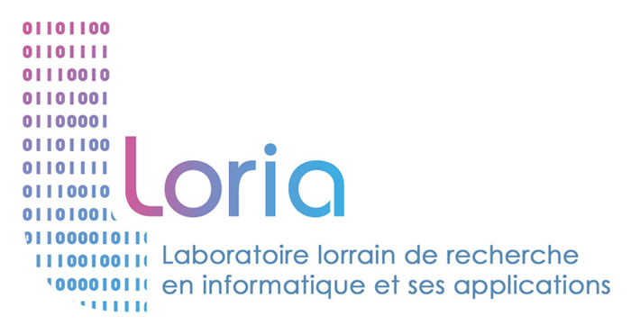{height=48px}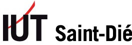{height=48px}{height=48px}

# Parcours

## Enseignement, recherche, développement, médiation

\centering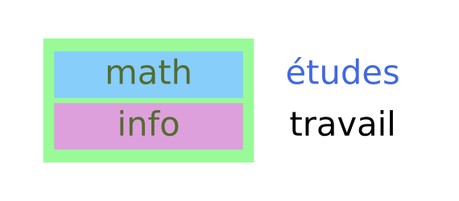{width=25%}\par
\centering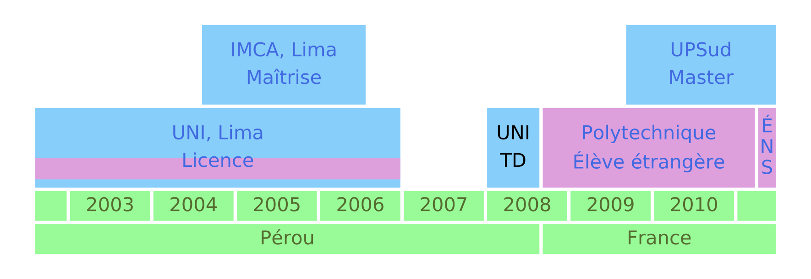{width=90%}\par
\centering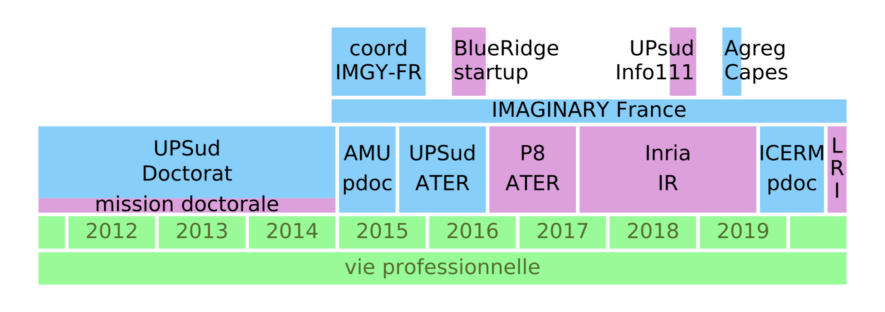{width=90%}\par

# Enseignement

## Expériences d'enseignement

|                    |                                |                                              |
| ---------------:| ------------------------- | ------------------------------------: |
|            2018 | U Paris-Sud (60h) | CEV Informatique                |
|                    |                               | L1, TD/TP                             |
|                    |                               | C++, Jupyter                          |
|                   |                                |                                               | 
| 2016--2017 | U Paris 8 (192h)     | ATER Informatique               |
|                    |                                | L2, M1, accessibilité             |
|                    |                                | Wordpress, Python              |
|                    |                                |                                             |
| 2015--2016 | U Paris-Sud (192h) |                                              |
|           2014 | U Paris-Sud (96h)    |                                             |
|           2008 | UNI (192h)               |                                             |

Au total,
$>$ **600 h**
dont **192h** responsable de cours.

## Cours donnés :

En L1 MPI (chargée de TD/TP) : Intro. à l’informatique (C++)

En L2 MIASHS Accessibilité/Géographie/Langage: 

- Calcul formel
    - SageMath, pour lequel il faut apprendre le Python
- Mathématiques numériques :
    - langage Python - calcul scientifique avec numpy/scipy
    
En M1 MIASHS Accessibilité/Géomatique: 

- Programmation objet 1 et 2
    - Java pour un public majoritairement neoinformaticien
- **CMS** et frameworks accessibles
    - Wordpress, y compris developpement de thèmes/plugins
    
Mais aussi: TD de géométrie et analyse en PCSO et d'autres cours de mathématiques

## Mon ATER à l'Université Paris 8 Vincennes Saint-Denis:

\centering{width=15%}\par

Charge de travail équivalente déjà à un MCF :

- seule personne à charge de tous mes cours 
- préparation de deux cours pour une nouvelle formation (la licence MIASHS)
- encadrement d'un étudiant de géomatique en alternance

L'accessibilité :

- thème principal du labo THIM, des formations MIASHS
- des étudiants aveugles en master
    - j'ai dû revoir de fond en comble ma façon d'enseigner

## Le PPN du DUT MMI

Dans l'organisation actuelle : 5 catégories, 2 UE par semestre, un enseignement progressif à partir des bases.

|Unités d'enseignement| Catégories               | Progression | 
|:------------------|:----------------|:---------------------|
|Communication, culture et connaissance de l'environnement socio-économique|Com./écriture|bases|
|                                                                |Esth./vidéo  | approfondissement|
|***Culture technologique et développement multimédia***| ***Info./réseaux***| maîtrise|
||*Transversal*||
|                                                  | Professionnalisation |approche professionalisante|

## Cours de la catégorie informatique / réseaux

|           |                                                            |
|:--------:|:----------------------------------------------------|
|M1202| Algorithmique et programmation|
|M1203| Services sur réseaux|
|M1205| Intégration web|
|M2203| Base de données|
|M2204| Services sur réseaux 2|
|M2206| Intégration web|
|M3202| Développement web|
|M3203| Programmation objet et événementielle|
|M3204| Services sur réseaux 3|
|M3206| Intégration multimédia|
|M4201C| Développement multimédia|
|M4203C| Intégration gestion de contenu|

------------------------------------------------------------------------------

\centering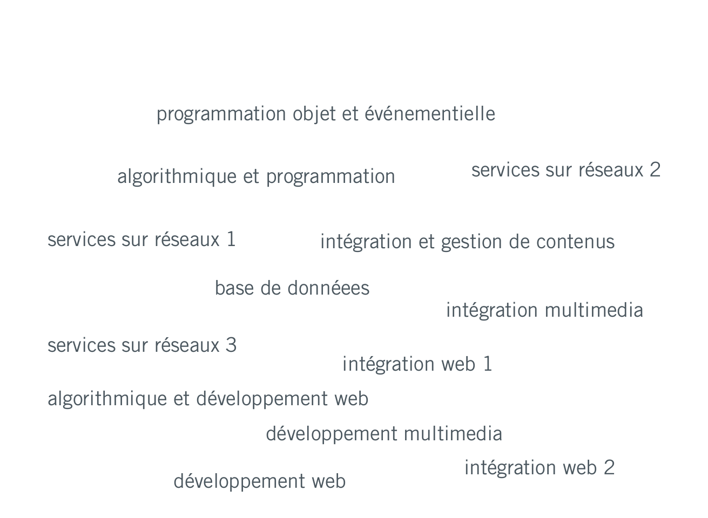{width=100%}\par

------------------------------------------------------------------------------

\centering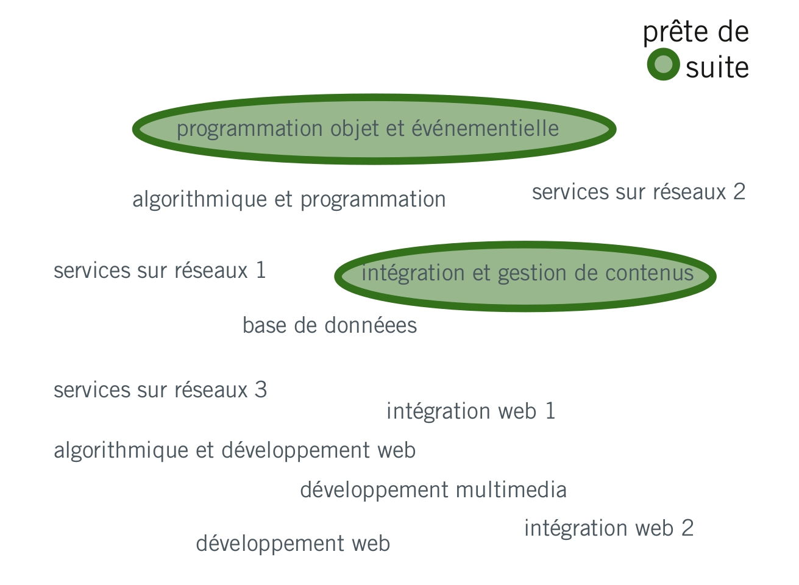{width=100%}\par

-----------------------------------------------------------------------------

\centering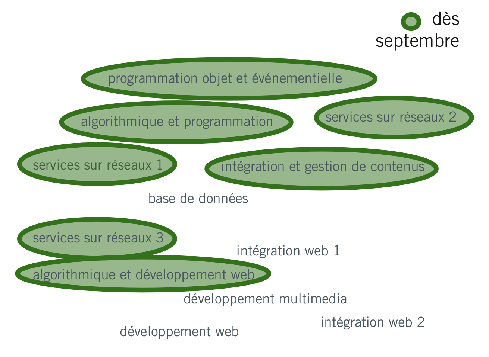{width=100%}\par

------------------------------------------------------------------------------

\centering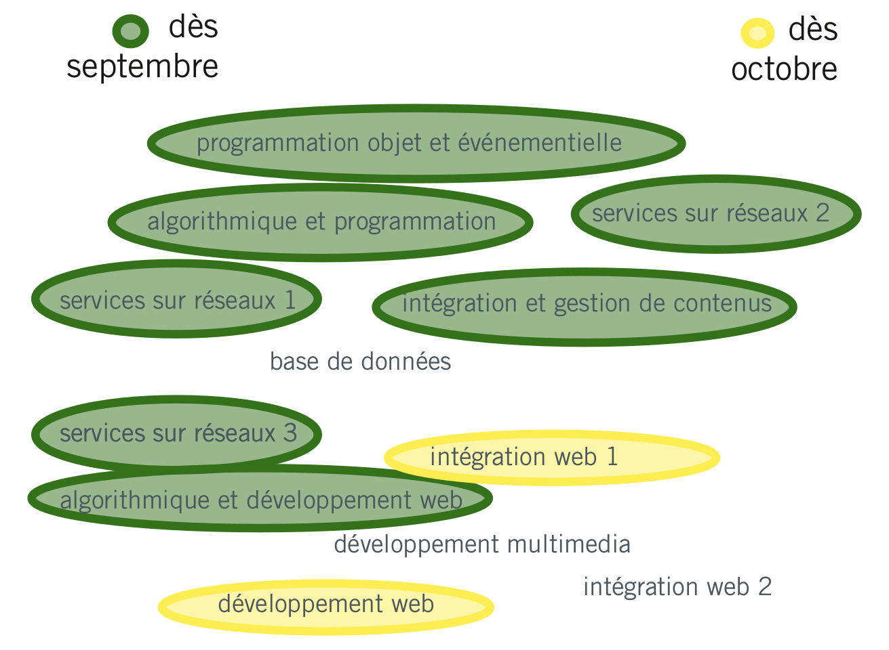{width=100%}\par

------------------------------------------------------------------------------

\centering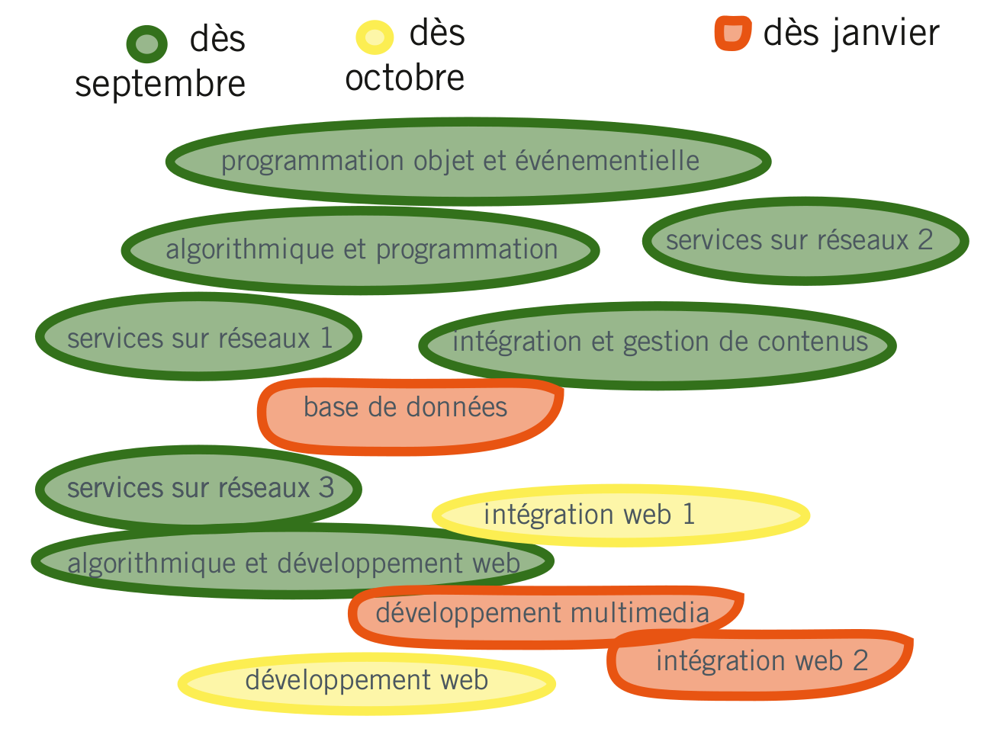{width=100%}\par

## Cours d'autres catégories 

La catégorie esthétique/vidéo:

- pas du domaine des MCF27 en général mais j'y vois l'opportunité pour des intéractions enrichissantes
- j'ai déjà scripté la création de fichiers svg en SageMath/Python et je produis dès fichiers pour l'impression 3D avec Blender
- je pourrais peut-être faire une intervention ? un atelier conjoint ?

La catégorie transversale:

Culture scientifique et traitement de l'information - cours de mathématiques sur trois semestres.

\centering{width=5%} Je suis prête à l'enseigner dès demain. {width=5%}\par

**Les licences pro Cross Media et TeCAM**: ... plein de possibilités.

## Contribuer une pierre au PPP

\centering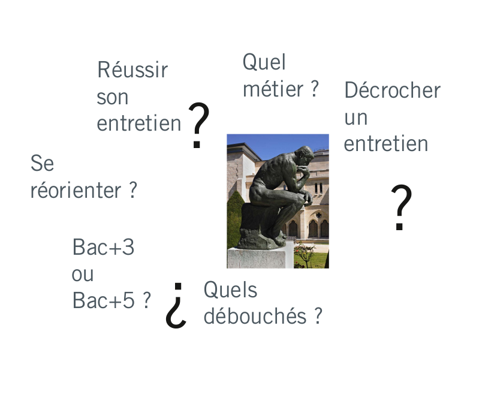{width=70%}\par

Mon réseau: Meetups, AudiMath, Conférences, Tiers lieux, Séminaires, IMAGINARY

## Projets tutorés à l'international

\centering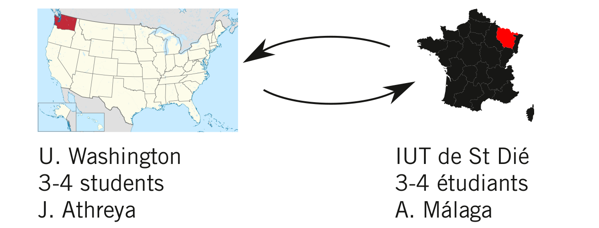{width=100%}\par

Exemples de projets :

- explorations de formes fractales
- les mathématiques des épidemies
- les grandes migrations

## Autre proposition de projet tutoré

Conception de casse-têtes en impression 3D et découpe laser

- regarder des casse-têtes existants (mathématiques ou pas)
- leur chercher d'autres expressions
- s'en inspirer pour d'autres casse-têtes
- venir les presenter en salon

\centering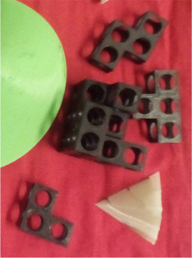\par

## La médiation scientifique

médiation autour de projets d'Art-Science dans le cadre de mon contrat doctoral :  •« La lumière ne s'arrête pas là »•« Premières intimités de l'être »•« Turbulent »• 

\centering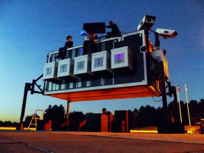{width=40%}\par
    
- IMAGINARY France  
    - plus de 150 heures face au grand public
    - plus de 10 événements organisés ; une rencontre autour des plateformes de partage
    - résautage actif : incitation à de nouvelles contributions, gestion des bénévoles

$+$ les sorties en école, forums, etc. avec les collègues 

## Intégration au MMI

- compétence pour enseigner les cours techniques
- intérêt pour la médiation et donc la communication
- souci de l'accessibilité

\centering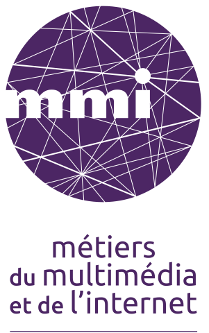{width=15%}\par

# Recherche

## Les systèmes dynamiques

- Evolution deterministe à court terme, qu'on connaît.
- Les questions qu'on se pose concernent l'évolution à long terme.

## Exemple: les rotations du cercle

\centering{width = 50%}\par

## Exemple: le flot linéaire sur un tore plat

### Qu'est-ce qu'un tore ?
### Comment bouge-t-on sur un tore ? 

[{width=60%}](http://albamath.com/snake)

### Retour aux rotations du cercle

## Exemple: les billards polygonaux

\centering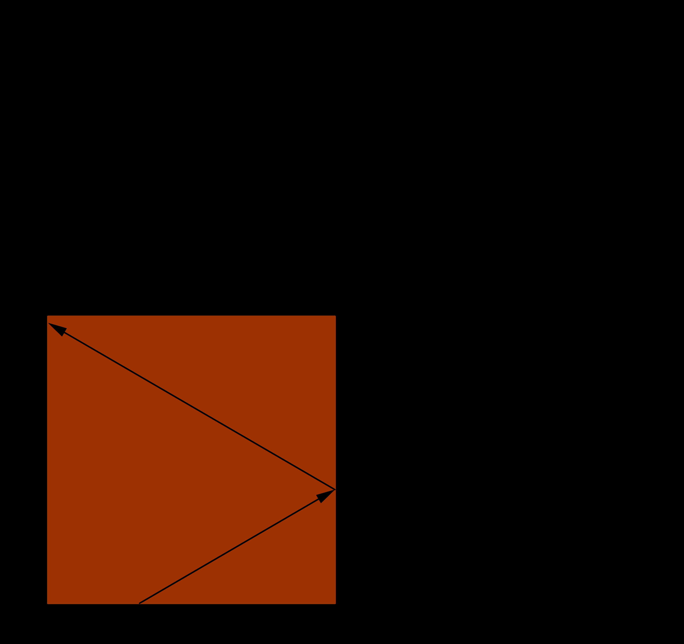{width=60%}\par

---------------------------------------------------

\centering{width=80%}\par

---------------------------------------------------

\centering{width=80%}\par

---------------------------------------------------

\centering{width=80%}\par

---------------------------------------------------

\centering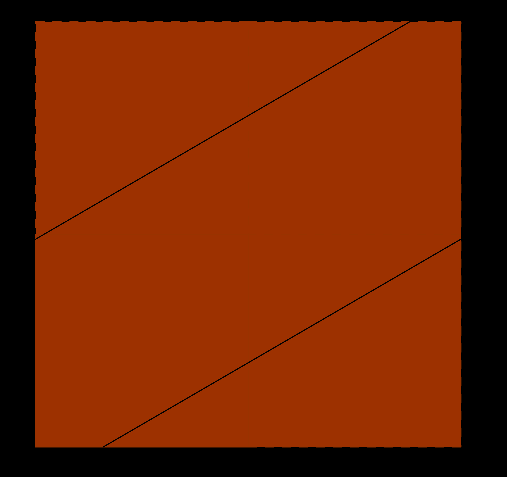{width=80%}\par

## Exemple: la surface en L

[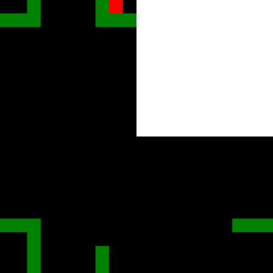{width=60%}](http://albamath.com/snake-L)

## Surfaces de translation et billards  «infinis»

{width=100%}

------------------------------------------------------------------------------------------

\centering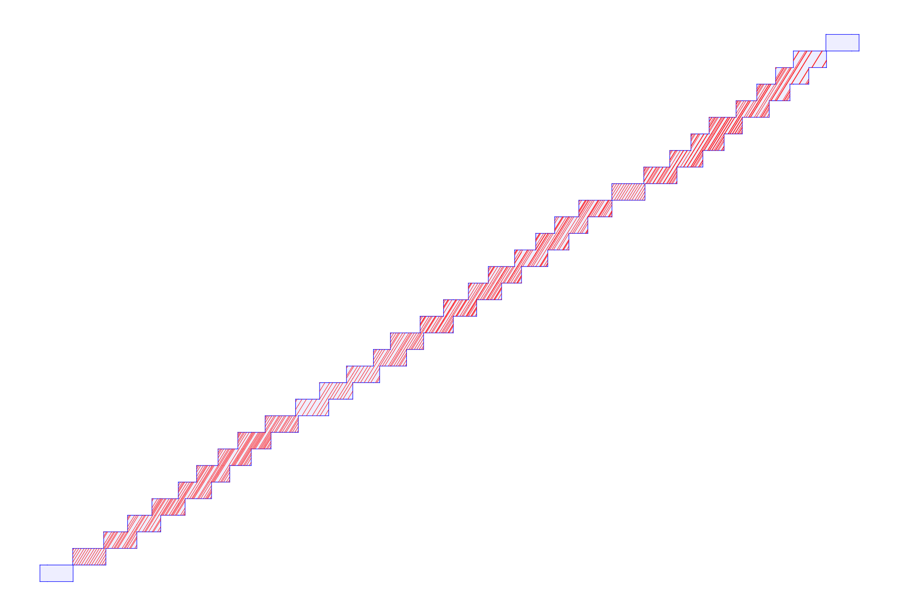{height=450px}\par

---------------------------------------------------------------------------------------

\centering{height=360px}

----------------------------------------------------------------------------------------

[{width=50%}](https://rantonse.no/demos/MirrorRoom/)

## Résultats

**Thm** (MS, 2014) Si l'on fixe une direction dans le plan alors la dynamique d'un escalier générique dans cette direction est conservative, minimale et ergodique.

**Thm:** (MS \& Troubetzkoy, 2015) Génériquement, la dynamique du wind-tree est minimale dans un large ensemble de directions. 

**Thm:** (MS \& Troubetzkoy, 2016) Génériquement, la dynamique du wind-tree dans presque toute direction est ergodique.

**Thm:** (MS \& Troubetzkoy, 2016) La dynamique d'un billard VH est faiblement mélangeante dans un ensemble large de directions.

**Thm:** (MS \& Troubetzkoy, 2017) Génériquement, la dynamique du wind-tree est d'indice ergodique infini dans un large ensemble de directions.

**Thm:** (MS \& Troubetzkoy, 2019) Génériquement, la dynamique du wind-tree est uniquement ergodique dans un large ensemble de directions.

**Thm:** (MS \& Troubetzkoy, 2019) Génériquement, la dynamique des surfaces en escalier est uniquement ergodique dans un large ensemble de directions.

## Publications

Alba Málaga Sabogal, Serge Troubetzkoy. (2016)  "Minimality of the Ehrenfest wind-tree model" *Journal of modern dynamics*. 10 (209-228)

Alba Málaga Sabogal, Serge Troubetzkoy. (2016)  "Ergodicity of the Ehrenfest wind–tree model." *Comptes Rendus Mathematique*. Volume 354, Issue 10, Pages 1032-1036.

Alba Málaga Sabogal, Serge Troubetzkoy, (2017). "Weakly mixing polygonal billiards." *Bull. London Math. Soc.*. 49 (141-147).

Alba Málaga Sabogal, Serge Troubetzkoy, (2018). "Infinite ergodic index of the Ehrenfest wind-tree model." *Commun. Math. Phys.*. 358 (995–1006x).

Alba Málaga Sabogal, Serge Troubetzkoy, (2019). "Unique ergodicity of infinite area translation surfaces." *preprint*

## Les Ehrenfest
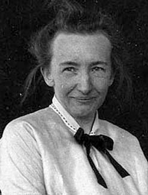{width=40%}
{width=40%}

## Application  à la conjecture des Ehrenfest

\centering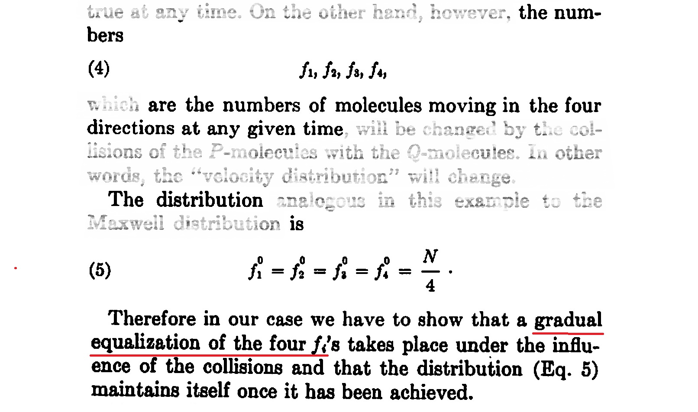{width=80%}\par

**Corollaire** (de MS \& Troubetzkoy, 2018) La conjecture des Ehrenfest est satisfaite par un wind-tree generique lorsque la fréquence des directions est calculée sur un domaine de mesure finie (mais arbitrairement grande).

# Intégration dans Gamble

